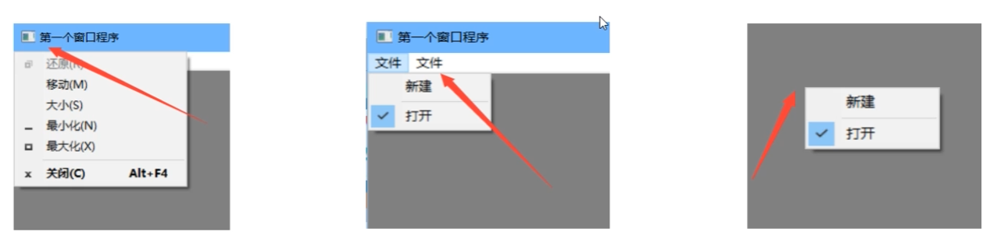

Windows桌面程序菜单有三种
- 系统菜单
- 顶层菜单
- 弹出式菜单（右键菜单）




### 添加菜单的方式

1. 在CreateWindow函数之前创建菜单， 然后在CreateWindow函数中指定菜单句柄
2. 在WM_CREATE消息中创建菜单


### 相关API

- CreateMenu : 创建顶层菜单
- CreatePopMenu : 创建另一个菜单的子菜单，或者右键菜单的顶层菜单
- InserMenuItem
- AppendMenu
- InsertMenu


#### CreateMenu

创建空白的顶层菜单栏。

```cpp
HMENU CreateMenu(void)
```

- 返回值

  - NULL: 创建失败

    


#### CreatePopMenu

创建一个空白的子菜单、下拉菜单或者快捷菜单。

需要使用InsertMenuItem来插入或附加菜单项。

还可以使用InsertMenu来插入菜单项和AppendMenu函数来追加菜单项。

```cpp
HMENU CreatePopMenu(void);
```


#### AppendMenu

```cpp
BOOL AppendMenu(
	HMENU hMenu,
    UINT uFlags,
 	UINT_PTR uIDNewItem,
    LPCSTR lpNewItem
)
```

- 将新的菜单项添追加到指定菜单栏、下拉菜单、子菜单或快捷菜单的末尾
- hMenu: 
- uFlags: 控制菜单项的外观和行为
  - MF_SEPRATOR:添加分隔符， uIDNewItem和lpNewItem参数会被忽略
- uIdNewItem: 菜单项的ID,不能重复
  - 当uFlags是WF_POPUP时，此参数要传入的是子菜单的句柄
- lpNewItem: 菜单项的名字
- 返回值
  - 0： 失败
  - 非0：成功


#### InsertMenu

```cpp
BOOL InsertMenu(
	HMENU hMenu;
    
)
```

